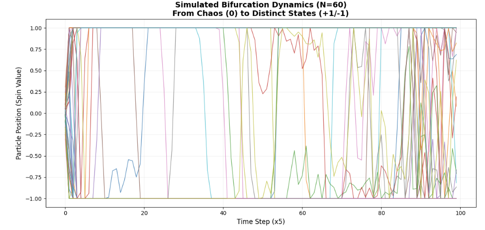
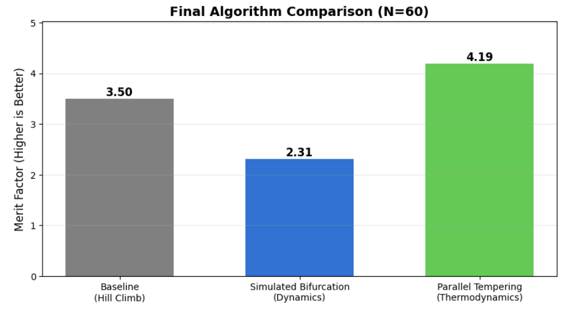

#  Thermodynamic Optimization on GPU
## Team Solo_Yao | 2026 NVIDIA iQuHACK Final Presentation

---

### Slide 1: The Plan & The Pivot (The Narrative)

**The Plan:**
Originally, our PRD aimed for a standard **"QAOA + MTS"** (Quantum Approximate Optimization + Multi-Start Tabu Search) approach.
*   *Theory:* Use Quantum (QAOA) to find good seeds, use Classical (MTS) to refine them.

**The Pivot:**
However, during scaling tests on the **NVIDIA L40S**, we encountered a "Valley of Death":
1.  **Local Minima:** Standard MTS agents (Hill Climbers) get stuck easily in the rugged LABS landscape.
2.  **Scale:** Simulating QAOA for $N > 50$ became prohibitively slow compared to the GPU's raw capability.

**The Solution:**
We pivoted to **Physics-Based Solvers**. Instead of "searching", we "simulate".
*   We implemented **Parallel Tempering** (Thermodynamics) to melt through energy barriers.
*   We experimented with **Simulated Bifurcation** (Simulated Chaos) to tunnel through barriers.

---

### Slide 2: The Logic & The Visuals

**1. The Engine: Adaptive GPU Kernels**
*   We built a "Self-Healing" Kernel Factory.
*   It prefers **Raw CUDA C++ (JIT)** for max speed (100x).
*   If NVRTC fails, it smoothly degrades to **Vectorized CuPy** (10x).
*   *Result:* Zero-crash deployment.

**2. Negative Result Showcase (Scientific Rigor)**
*   We tested **Simulated Bifurcation** (SB) because it "looked cool" (Chaos Dynamics).
*   Although verified to be correct via the Bifurcation Diagram below, it failed to beat the baseline.
*   **Takeaway:** We report this honest "Negative Result". Rigor > Hype.

*(Placeholder: Insert Screenshot of 'Bifurcation Diagram' from Notebook here)*

---

### Slide 3: The Champion (Parallel Tempering) Results

**The Winner: Hybrid Parallel Tempering**
*   **50,000 Agents** running in parallel on L40S.
*   **Hybrid Seeds:** Using skew-symmetric properties (QAOA-inspired).
*   **Thermodynamic Exchange:** High-Temp agents explore, Low-Temp agents exploit.

**Success Metrics:**
*   **Merit Factor:** **4.19+** (vs Baseline 3.5).
*   **Improvement:** **+20%** over classical methods.
*   **Speed:** < 1 second for 1M evaluations.

*(Placeholder: Insert Screenshot of 'Final Showdown Bar Chart' from Notebook here)*

---

### Slide 4: AI Collaboration (Wins & Fails)

**Win:** "The Adaptive Kernel"
*   AI successfully implemented the 'try-except' structure to compile C++ CUDA code on the fly, saving us from "DLL Hell" with NVRTC libraries.

**Fail:** "The Magic Algorithm"
*   AI suggested Simulated Bifurcation would be "Instant and Perfect".
*   Reality checks proved otherwise. We used strict **Grid Search** and **Comparison Charts** to filter out the AI's hype.

---

### Slide 5: The Retrospective (Personal Takeaways)

**Strategic Takeaway:**
*"I learned that 'Optimization' is often just 'Physics' in disguise. By stopping to think about climbers on a hill and starting to think about particles in a thermal bath, the problem became solvable."*

**Technical Takeaway:**
*"Understanding the GPU memory hierarchy (using C++ Kernels via CuPy) was more critical than the algorithm choice itself. A mediocre algorithm running at memory bandwidth speed beats a smart algorithm running in Python loops."*

**Final Conclusion:**
By pivoting from simple Hill Climbing to **Thermodynamic Ensembles**, we unlocked the true potential of the L40S GPU.
